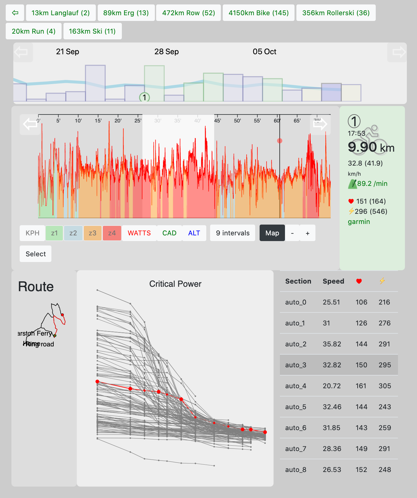
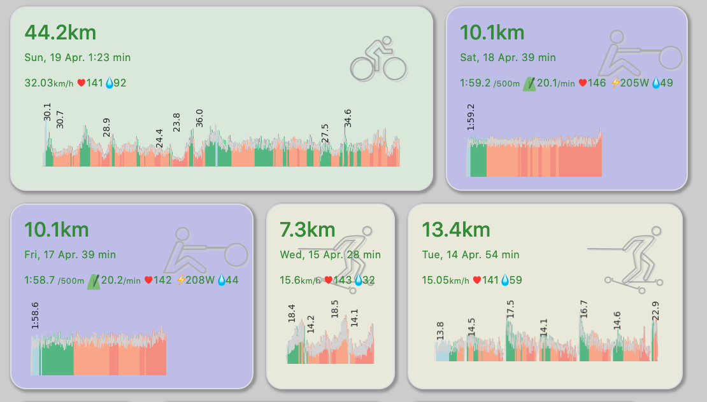

GoldenD3tah
===========

A set of tools to display and explore training data.

graph
-----

`graph.php` is mostly a D3 visualisation (the php only serves to filter by sport). It uses the `activities.json` file to generate 
- a summary row of sports, with total distance and number of sessions
- a bar graph overview of activities (height is TSS)
- the blue line marks the rolling weekly TSS (training intensity)

Click on any number of bars to open up the detailed view to the activity.

json2html
---------

Takes a folder of GoldenCheetah style json files and presents them is a simple overview format.

Scans the `activities` folder and other specified folders for any files that have not yet been imported (i.e. are not listed in `activities.json` yet).

Generates a simple sparkline of the speed profile, colour filled by heart rate zone. 

Automatically identifies intervals, generates key stats for each and labels their average speed on the sparkline.

Identifies periods of highest power and speed to generate Critical Power and Critical Speed plots.

Calculates Training Stress Scores (TSS) based on heart rate.

fit2json
--------

`fit2json.py` imports fit files and stores them in a GoldenCheetah style json format. If placed inside the `activities` folder of a GoldenCheetah profile, these json files can be viewed and edited within GoldenCheetah.
Equally, files can be imported with GoldenCheetah for any of the rest to work. In other words, `fit2json.py` is an optional extra.

Benefits include:

- Control over sport naming conventions (no more 'bike', 'biking', 'cycling' mess, let alone inconsistent capitalisation)
- Automatic re-sampling to 1 second readings. Helpful for mean value calculations and consistent display of data.

